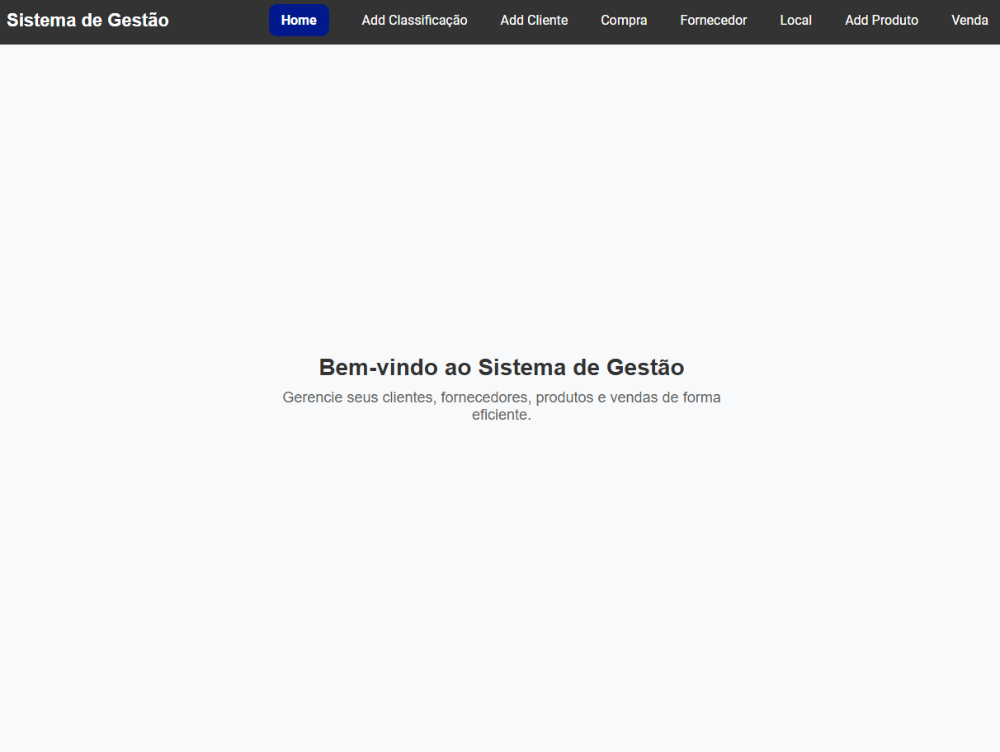
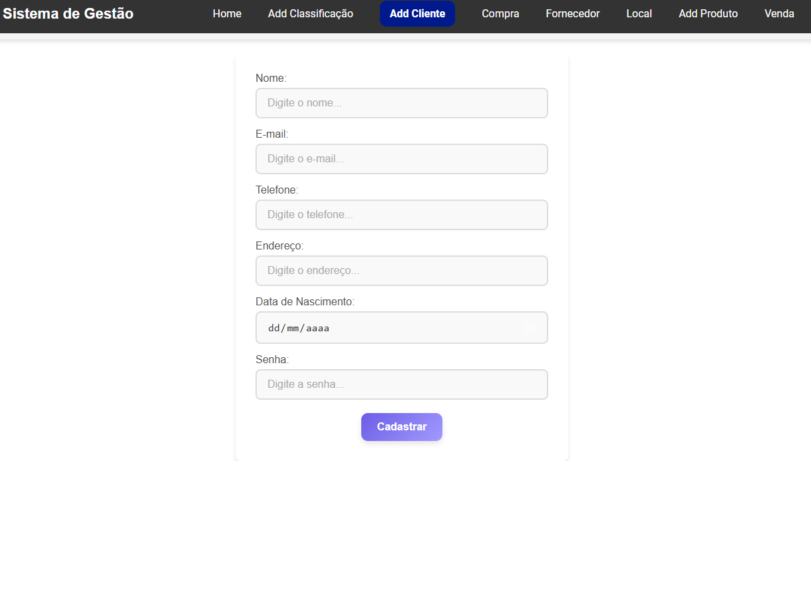
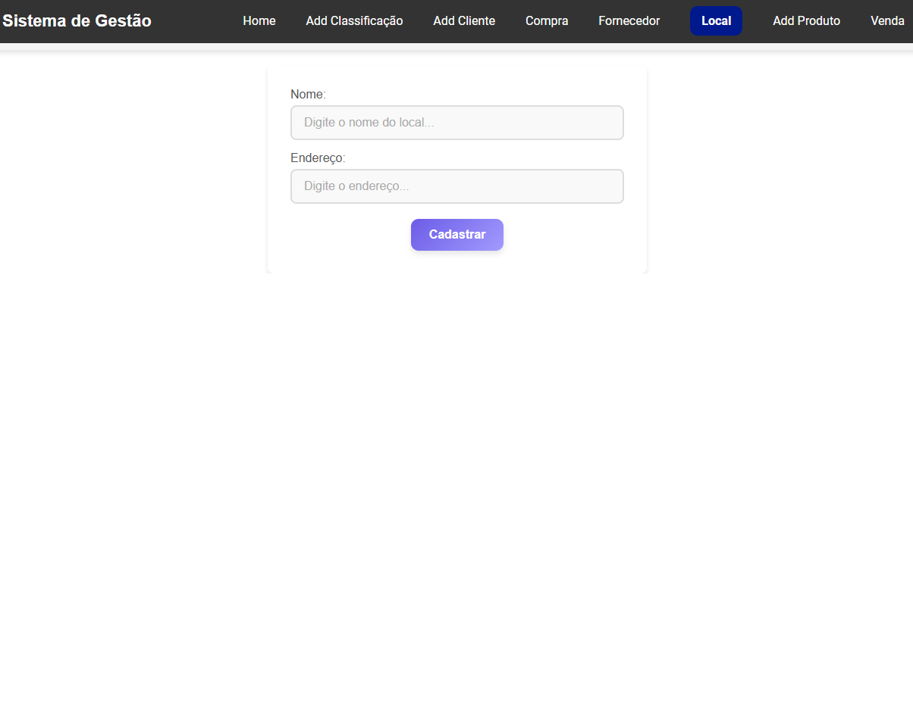

# 🛒 Aplicação Mercado - Next.js 🚀



## 📌 Sobre o Projeto

Este é um projeto desenvolvido com **Next.js** que simula um sistema de mercado, permitindo a gestão de produtos, fornecedores e pedidos. A aplicação está containerizada utilizando **Docker** para facilitar a implantação e escalabilidade.

---

## ⚙️ Tecnologias Utilizadas

- **Next.js** - Framework React para aplicações web modernas
- **Docker** - Containerização para facilitar a execução da aplicação
- **Node.js 22** - Ambiente de execução JavaScript no servidor
- **Alpine Linux** - Imagem base leve para os containers
- **MySQL** - Banco de dados relacional para armazenamento dos produtos e pedidos

---

## 📸 Prints da Aplicação

### 🔹 Página Inicial


### 🔹 Listagem de Produtos


### 🔹 Cadastro de Novo Produto


---

## 📦 Como Rodar a Aplicação

### 🔹 1. Clonar o Repositório
```sh
git clone https://github.com/adimael/front-end-mercado-next.git
cd front-end-mercado-next
```

```sh
npm install
```

```sh
npm run dev
```

## 📦 Imagem no Docker Hub

### A imagem desta aplicação está disponível no Docker Hub:
### 🔗 Docker Hub: https://hub.docker.com/r/adimael/mercado-frontend

Para baixar e rodar a imagem diretamente, utilize:

```sh
docker pull seu-usuario/mercado-frontend:0.1
docker run -p 3000:3000 seu-usuario/mercado-frontend:0.1
```
#### A aplicação estará disponível em http://localhost:3000.


